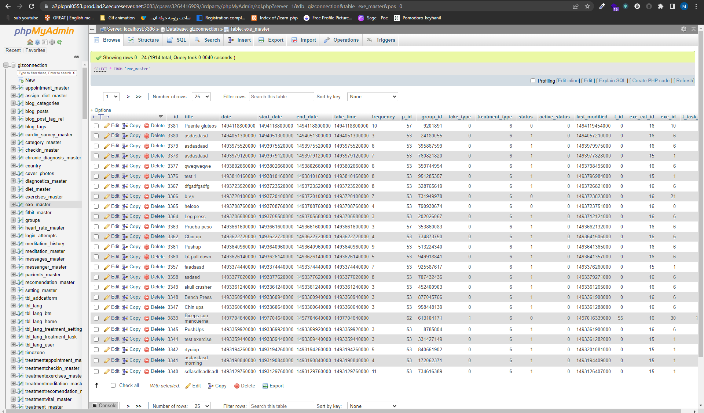

# todolist-mkeyhanil

<h2>Create a todo list with react and useReducer</h2>

<h3>Features</h3>
<ul>
    <li><h3>Add your task</h3></li>
    <li><h3>Check the input if client put blank and shop it</h3></li>
    <li><h3>Control of task</h3></li>
    <li><h3>Delete the task</h3></li>
    <li><h3>Single page</h3></li>
    <li><h3>Using design font by google</h3></li>
</ul>

<h3>What packages & library included</h3>
<ul>
    <li><h3>ReactJs</h3></li>
	<li><h3>Tailwindcss</h3></li>
</ul>

<h3>Looking around of TodoList-mkeyhanil </h3>
